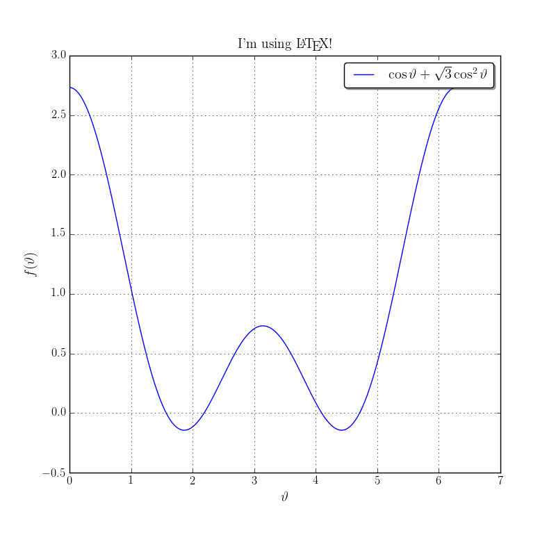
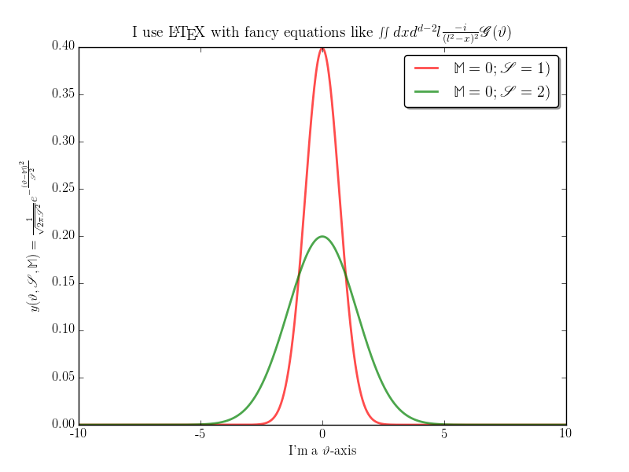

Easily $\LaTeX$ `matplotlib` plots
===============

##Get it working
Clone this repository

    git clone https://github.com/flipdazed/latex_matplotlib.git

delete the `.git` bit if you want no `git` history
    
    cd latex_matplotlib
    rm .git*

I'm too busy to properly package it for `pip` so to use it everywhere then in `bash` terminal

    
    export PYTHONPATH="/LOCATION/TO/latex_matplotlib:$PYTHONPATH"

where `/LOCATION/TO/` is the location to `latex_matplotlib` that can be found by typing `pwd` in the terminal.

This may be obvious but if you delete the directory it won't work anymore!

### copy-paste quick start
Just copy past all of this in a sensible location e.g. `~/Documents/pythonScripts/`

    git clone https://github.com/flipdazed/latex_matplotlib.git
    LOC=$(pwd)
    echo 'export PYTHONPATH="'$LOC'/latex_matplotlib:$PYTHONPATH"' >> ~/.bash_profile
    source ~/.bash_profile

##Usage
The following example is found in `examples/basic.py`

    
    import matplotlib.pyplot as plt
    from latex_matplotlib import Pretty_Plotter
    import numpy as np
    
    pp = Pretty_Plotter()
    
    t = np.linspace(0,np.pi*2,1000)
    f = np.cos(t)+np.sqrt(3.)*np.cos(t)**2
    plt.plot(t,f, label=r'$\cos{\vartheta}+\sqrt{3}\cos^2{\vartheta}$')
    
    plt.title(r"I'm using \LaTeX !")
    plt.ylabel(r'$f(\vartheta)$')
    plt.xlabel(r'$\vartheta$')
    plt.legend(loc='best', shadow=True, fancybox=True)
    plt.show()

to give the following figure

a more exciting example can be found in `examples/demo.py` which gives

